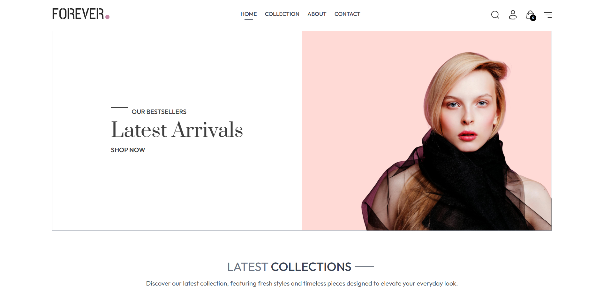
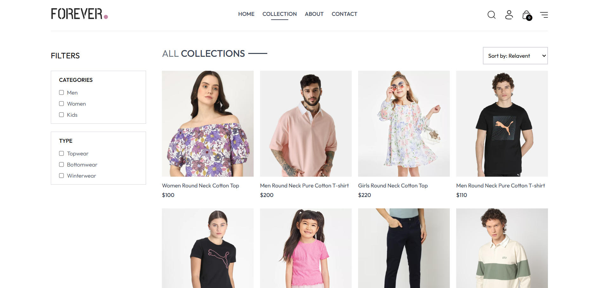
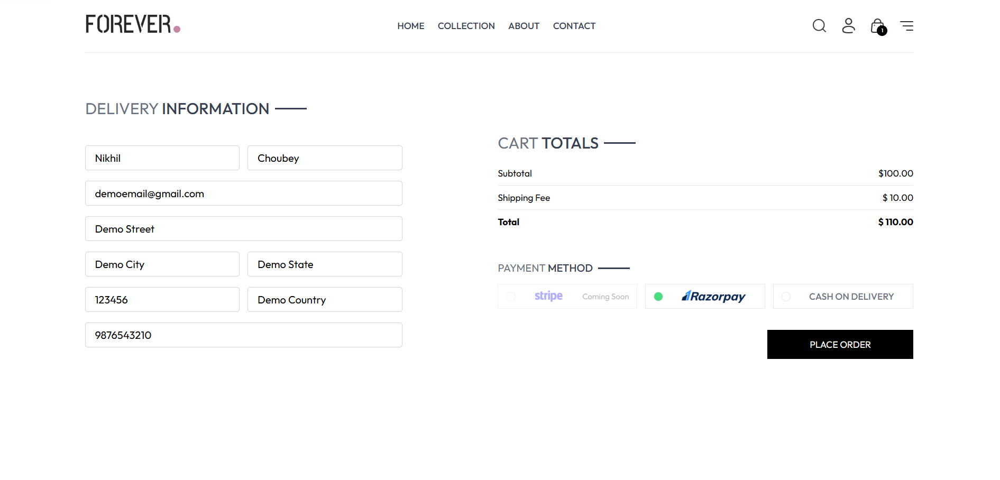
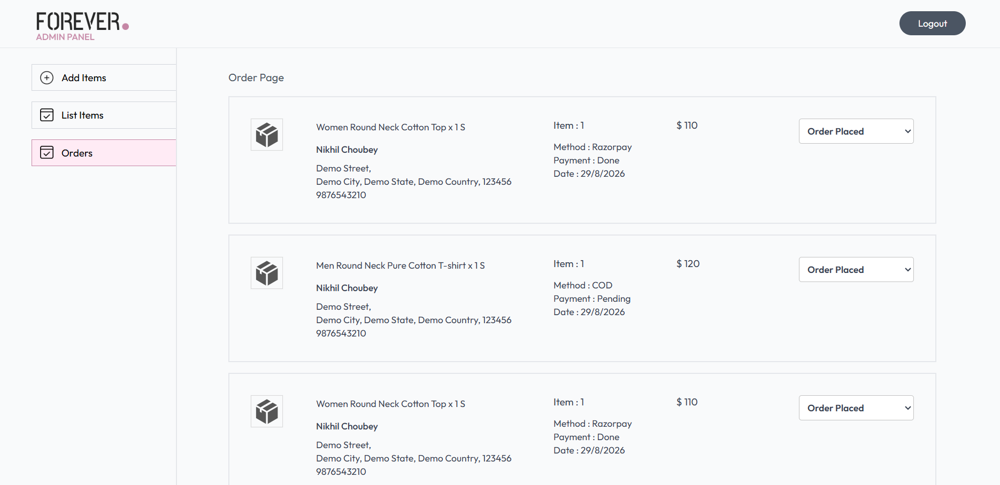
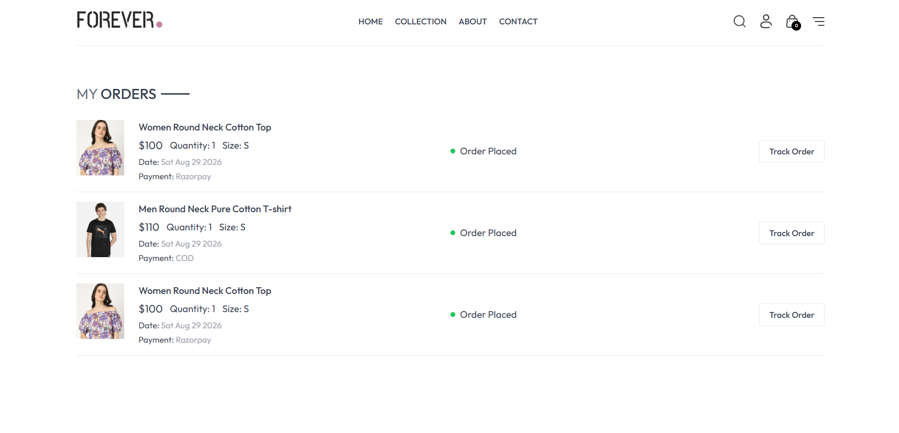

# 🛍️ Forever — MERN E-Commerce Platform

A full-stack e-commerce platform built with the MERN stack — featuring a customer storefront, secure authentication, cart & checkout, Razorpay payments, Cash on Delivery, and a dedicated admin dashboard.

[](https://react.dev/)
[](https://nodejs.org/)
[](https://expressjs.com/)
[](https://www.mongodb.com/atlas)
[](https://vercel.com/)

[Live Store](https://mern-ecommerce-frontend-three-gamma.vercel.app/) · [Admin Panel](https://mern-ecommerce-admin-mocha.vercel.app/) · [Backend API](https://mern-ecommerce-backend-ecru.vercel.app/)

---

## 📑 Table of Contents

- [About the Project](#-about-the-project)
- [Live Demo](#-live-demo)
- [Features](#-features)
- [Payment Methods](#-payment-methods)
- [Admin Panel](#-admin-panel)
- [System Architecture](#️-system-architecture)
- [Tech Stack](#️-tech-stack)
- [Project Structure](#-project-structure)
- [Getting Started](#️-getting-started)
- [Environment Variables](#-environment-variables)
- [Application Workflow](#-application-workflow)
- [Security](#-security)
- [Testing](#-testing)
- [Deployment](#️-deployment)
- [Future Improvements](#-future-improvements)
- [Key Learning Outcomes](#-key-learning-outcomes)
- [Author](#-author)
- [License](#-license)

---

## 📖 About the Project

**Forever** is a full-stack e-commerce application built on the MERN stack, designed around a complete real-world shopping workflow — from browsing products to placing an order and managing it through an admin dashboard.

The project is split into three independent applications:

| App | Purpose |
|---|---|
| **Frontend** | Customer-facing storefront |
| **Backend** | REST API, authentication, database, orders & payments |
| **Admin Panel** | Product and order management dashboard |

---

## 🚀 Live Demo

| Application | Link |
|---|---|
| 🛍️ Customer Store | [mern-ecommerce-frontend-three-gamma.vercel.app](https://mern-ecommerce-frontend-three-gamma.vercel.app/) |
| 🔐 Admin Panel | [mern-ecommerce-admin-mocha.vercel.app](https://mern-ecommerce-admin-mocha.vercel.app/) |
| ⚙️ Backend API | [mern-ecommerce-backend-ecru.vercel.app](https://mern-ecommerce-backend-ecru.vercel.app/) |

---

### 📸 Screenshots

#### 🏠 Customer Store — Home



#### 🛍️ Product Collection



#### 💳 Checkout



#### 🔐 Admin Dashboard



#### 📦 Customer Order History



---


## ✨ Features

### 🛍️ Customer Store
- Modern, responsive storefront UI
- Browse products and product collections
- Detailed product view with size selection
- Product search
- Cart management (add, update quantity, remove)
- Checkout with delivery details
- Multiple payment methods
- Order placement and order history
- Order status tracking
- About, Contact, and Newsletter sections
- Fully responsive across desktop, tablet, and mobile

### 👤 Authentication
- User registration & login
- JWT-based authentication
- Secure password handling
- Protected routes and API operations
- Persistent authentication state

### 🛒 Shopping Cart
- Add products with selected size
- Increase / decrease quantities
- Remove items
- Live cart total
- Seamless checkout handoff

### 📦 Order Management
- Delivery information capture
- Payment method selection
- Order placement synced to MongoDB
- Order history and live status for customers
- Full visibility into orders via the admin panel

---

## 💳 Payment Methods

| Method | Status |
|---|---|
| **Razorpay** | ✅ Fully integrated — sensitive credentials handled server-side |
| **Cash on Delivery** | ✅ Available as an alternative to online payment |
| **Stripe** | 🚧 Coming soon — not yet functional |

---

## 🧑‍💼 Admin Panel

A separate dashboard for managing the platform, sharing the same backend API as the storefront.

- Admin authentication
- Add, view, and delete products
- Upload product images
- Manage product details
- View customer orders and order details
- Update order status and manage fulfillment workflow

---

## 🏗️ System Architecture

```text
┌────────────────────┐        ┌────────────────────┐
│  Customer Frontend  │        │     Admin Panel     │
│   React + Vite      │        │    React + Vite      │
└──────────┬──────────┘        └──────────┬──────────┘
           │        REST API              │
           └───────────────┬──────────────┘
                            ▼
                 ┌─────────────────────┐
                 │       Backend        │
                 │  Node.js + Express   │
                 └───────┬────────┬─────┘
                         │        │
              ┌──────────▼───┐  ┌─▼─────────────┐
              │   MongoDB     │  │  Razorpay API  │
              │   Database    │  │                │
              └───────────────┘  └────────────────┘
```

---

## 🛠️ Tech Stack

**Frontend** — React · Vite · React Router · Tailwind CSS · Axios · React Toastify
**Backend** — Node.js · Express.js · MongoDB · Mongoose · JWT · Razorpay · REST APIs
**Admin Panel** — React · Vite · Tailwind CSS · Axios · React Router
**Database** — MongoDB Atlas
**Deployment** — Vercel

---

## 📁 Project Structure

```text
mern-ecommerce-website/
│
├── admin/
│   ├── public/
│   ├── src/
│   ├── package.json
│   └── ...
│
├── backend/
│   ├── config/
│   ├── controllers/
│   ├── middleware/
│   ├── models/
│   ├── routes/
│   ├── server.js
│   ├── package.json
│   └── vercel.json
│
├── frontend/
│   ├── public/
│   ├── src/
│   │   ├── assets/
│   │   ├── components/
│   │   ├── pages/
│   │   ├── App.jsx
│   │   └── main.jsx
│   ├── package.json
│   └── ...
│
├── screenshots/
│   ├── home.png
│   ├── collection.png
│   ├── checkout.png
│   ├── admin.png
│   └── orders.png
│
├── .gitignore
└── README.md
```

---

## ⚙️ Getting Started

### Prerequisites
- Node.js
- npm
- MongoDB Atlas account
- Git

### 📥 Clone & Setup

```bash
git clone https://github.com/nikhilranjanchoubey/mern-ecommerce-website.git
cd mern-ecommerce-website
```

The repo contains three independent apps — `frontend/`, `backend/`, and `admin/` — each with its own dependencies.

### ▶️ Run the Backend

```bash
cd backend
npm install
```

Create a `.env` file inside `backend/`:

```env
MONGODB_URI=your_mongodb_connection_string
JWT_SECRET=your_jwt_secret
RAZORPAY_KEY_ID=your_razorpay_key_id
RAZORPAY_KEY_SECRET=your_razorpay_key_secret
```

```bash
npm run server
```

### ▶️ Run the Frontend

```bash
cd frontend
npm install
```

Create a `.env` file inside `frontend/`:

```env
VITE_BACKEND_URL=your_backend_url
```

```bash
npm run dev
```

### ▶️ Run the Admin Panel

```bash
cd admin
npm install
npm run dev
```

Configure the backend API URL according to the environment variables used by the admin app.

---

## 🔐 Environment Variables

**Backend**
```env
MONGODB_URI=your_mongodb_connection_string
JWT_SECRET=your_jwt_secret
RAZORPAY_KEY_ID=your_razorpay_key_id
RAZORPAY_KEY_SECRET=your_razorpay_key_secret
```

**Frontend**
```env
VITE_BACKEND_URL=your_backend_url
```

> ⚠️ **Never commit `.env` files or secret keys to GitHub.** Keep MongoDB URIs, JWT secrets, Razorpay keys, and any other private credentials in environment variables only.

---

## 🔄 Application Workflow

```text
Register / Login
      │
      ▼
Browse Products → Select Size → Add to Cart
      │
      ▼
Checkout → Enter Delivery Info
      │
      ▼
Choose Payment Method
      ├── Razorpay
      └── Cash on Delivery
      │
      ▼
Order Created → Stored in MongoDB
      │
      ▼
Admin Reviews & Updates Order Status
      │
      ▼
Customer Views Updated Order Status
```

---

## 🔒 Security

- JWT-based authentication
- Protected API routes
- Secure password handling
- Environment variables for all sensitive credentials
- Payment credentials handled entirely server-side
- No secret keys exposed to the frontend

---

## 🧪 Testing

The deployed application has been manually verified end-to-end, covering:

- Registration & login
- Product browsing and cart operations
- Checkout with Cash on Delivery and Razorpay
- Order creation and admin visibility
- Admin order status updates
- Customer-side order status reflection

---

## ☁️ Deployment

| Application | Platform |
|---|---|
| Customer Frontend | Vercel |
| Admin Panel | Vercel |
| Backend API | Vercel |
| Database | MongoDB Atlas |

**Production URLs:**
- Frontend: https://mern-ecommerce-frontend-three-gamma.vercel.app/
- Admin: https://mern-ecommerce-admin-mocha.vercel.app/
- Backend: https://mern-ecommerce-backend-ecru.vercel.app/

---

## 🔮 Future Improvements

- Complete Stripe integration
- Wishlist functionality
- Product reviews and ratings
- Advanced filtering & search
- Email notifications
- Admin analytics and sales reports
- Improved order tracking
- Additional payment methods

---

## 🎯 Key Learning Outcomes

Building Forever provided hands-on experience with full-stack MERN development, REST API design, MongoDB/Mongoose modeling, JWT authentication, cart and order management, payment gateway integration, admin dashboard development, environment variable management, and end-to-end production deployment across multiple connected services.

---

## 👨‍💻 Author

**Nikhil Ranjan Choubey**
GitHub: [@nikhilranjanchoubey](https://github.com/nikhilranjanchoubey)

---

## ⭐ Support

If you found this project useful, consider giving the repository a ⭐ on GitHub.

---

## 📄 License

This project was developed for educational, learning, and portfolio purposes.